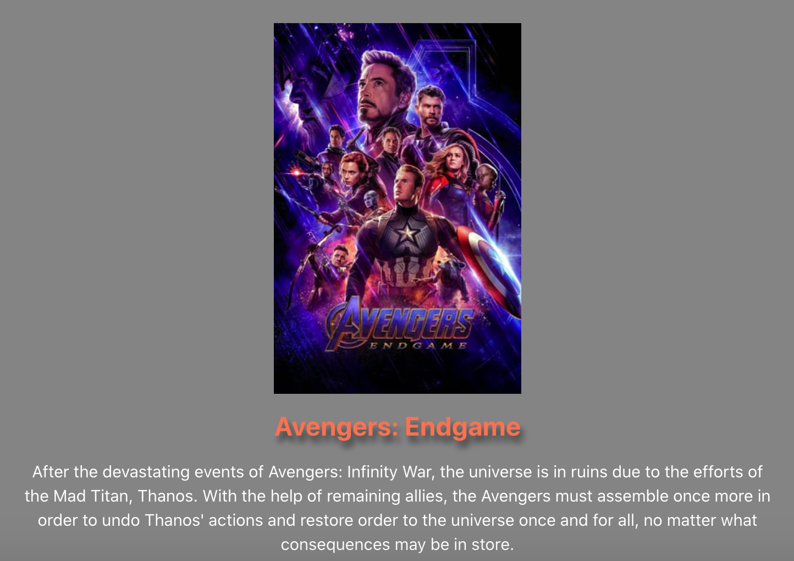

# My Movie Queue
## Description
An application that allows users to search movies and save the ones they want to watch.

## Table of Contents
* [Installation](https://github.com/kesiahp18/my-movie-queue#installation)
* [Usage](https://github.com/kesiahp18/my-movie-queue#usage)
* [Technologies](https://github.com/kesiahp18/my-movie-queue#technologies)
* [Contributors](https://github.com/kesiahp18/my-movie-queue#contributors)

## Installation
This is a web application that can be visited [here](https://my-movie-queue.herokuapp.com)

## Usage
This is a web application that can be visited [here](https://my-movie-queue.herokuapp.com)

## Technologies
* React
* Node.js
* Graphql
* Apollo
* Mongo
* Express
* bcrypt
* TMDB

## Contributors

This application was created by [Kesiah Patil](https://github.com/kesiahp18), [Melanie Schellberg](https://github.com/mschellberg), [Jonathan Robinson](https://github.com/Jonathan-84), and [Maria Cannon](https://github.com/MCannon33). 